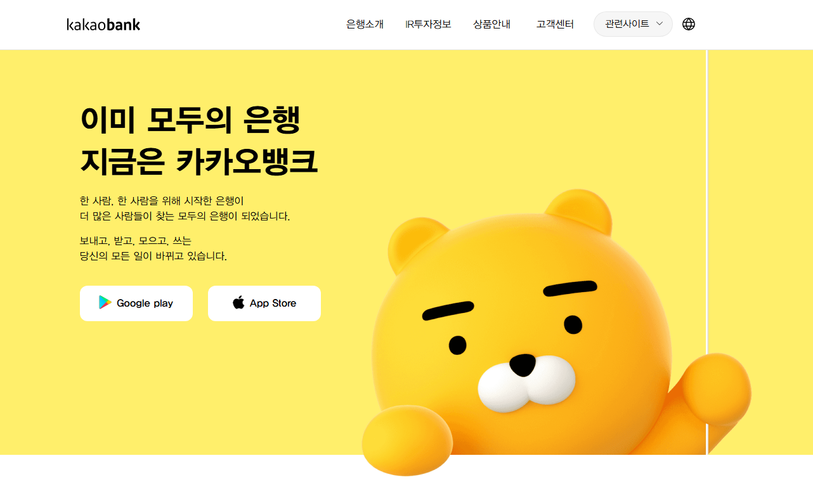

## 🏦 카카오뱅크 데모 페이지

이 프로젝트는 **카카오뱅크 데모 페이지**를 제작한 것입니다.  
HTML, CSS, JavaScript, jQuery, AJAX, Bootstrap을 활용하여 개발하였습니다.

### 📅 프로젝트 기간  
🗓 **2025년 2월 11일 ~ 2월 21일**

### 🚀 사용 기술  
- **Frontend**: HTML, CSS, JavaScript, Bootstrap  
- **JavaScript 라이브러리**: jQuery, AJAX  
- **프로젝트 관리**: Jira  
- **프로토타이핑**: Figma  

### 📌 주요 기능  
- 카카오뱅크 메인 페이지 스타일링  
- 카카오뱅크 주요 페이지 스타일링
- AJAX를 활용한 비동기 데이터 처리  
- jQuery를 사용한 동적 UI 구성

### 🖼️ 데모 이미지  

### 🛠️ 실행 방법  
1. 프로젝트 클론  
   bash
   git clone https://github.com/dbwogns1/miniproject1.git

2. 로컬 환경에서 실행  
   - `index.html`을 브라우저에서 실행

3. https://dbwogns1.github.io/miniproject1/ 접속

### 🐝 라이센스  
본 프로젝트는 개인 학습 및 포트폴로오 용도로 제작되었습니다.

### 🎞 PPT
https://docs.google.com/presentation/d/1s2dPEXH7PTaynj4poTgOTtKzQ6aNVDKQiXL-FrxbjaQ/edit?usp=sharing
